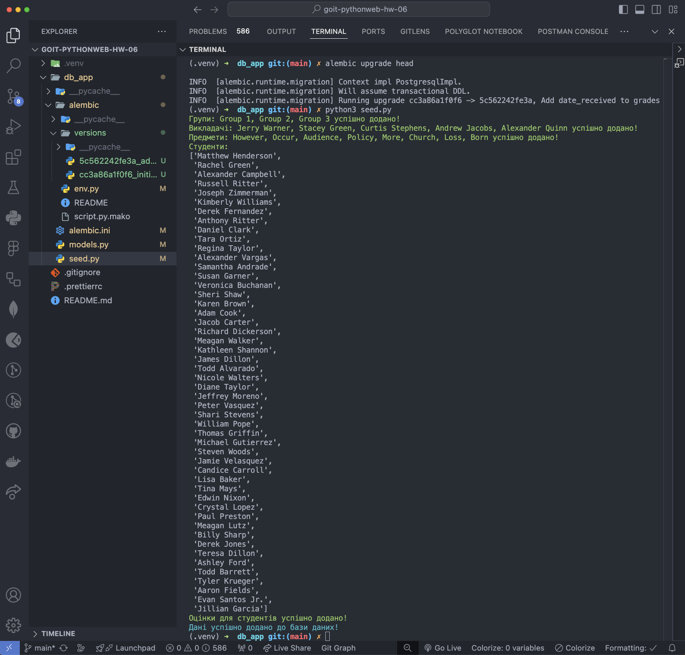
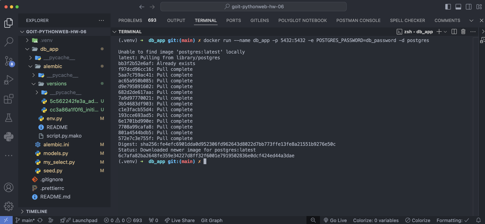
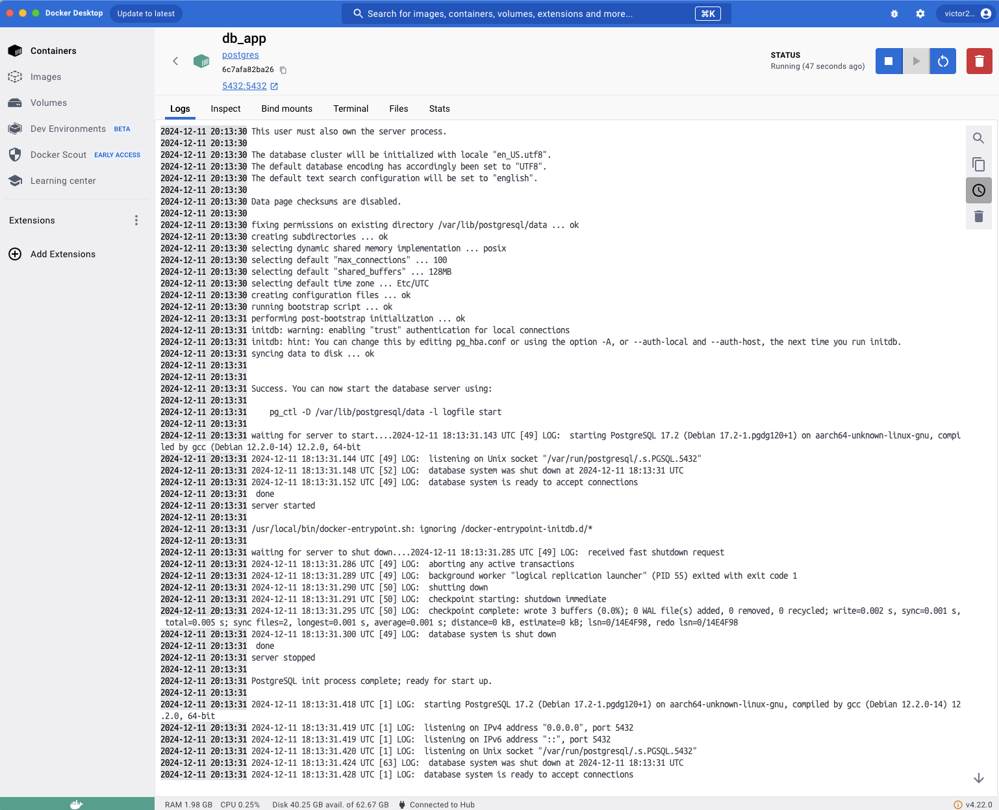

# Тема 6. Домашня робота

Реалізуйте базу даних, схема якої містить:

- Таблиця студентів;
- Таблицю груп;
- Таблицю викладачів;
- Таблицю предметів із вказівкою викладача, який читає предмет;
- Таблицю, де у кожного студента є оцінки з предметів із зазначенням коли оцінку
  отримано;

В цій домашній роботі використаємо базу даних `postgres`. У командному рядку
запустіть `Docker` контейнер:

```bash
docker run --name some-postgres -p 5432:5432 -e POSTGRES_PASSWORD=mysecretpassword -d postgres
```

Замість `some-postgres` виберіть свою назву контейнера, а замість
`mysecretpassword` придумайте свій пароль для підключення до бази даних

## Технічний опис завдання

### Перший крок

Реалізуйте свої моделі **SQLAlchemy**, для таблиць:

- Таблиця студентів;
- Таблиця груп;
- Таблиця викладачів;
- Таблиця предметів із вказівкою викладача, який читає предмет;
- Таблиця де кожен студент має оцінки з предметів із зазначенням коли оцінку
  отримано;

### Другий крок

Використовуйте `alembic` для створення міграцій у базі даних.

### Третій крок

Напишіть скрипт `seed.py` та заповніть отриману базу даних випадковими даними
(~30-50 студентів, 3 групи, 5-8 предметів, 3-5 викладачів, до 20 оцінок у
кожного студента з усіх предметів). Використовуйте пакет `Faker` для наповнення.
При заповненні використовуємо механізм сесій **SQLAlchemy**.

### Четвертий крок

Зробити наступні вибірки з отриманої бази даних:

1. Знайти 5 студентів із найбільшим середнім балом з усіх предметів.
2. Знайти студента із найвищим середнім балом з певного предмета.
3. Знайти середній бал у групах з певного предмета.
4. Знайти середній бал на потоці (по всій таблиці оцінок).
5. Знайти які курси читає певний викладач.
6. Знайти список студентів у певній групі.
7. Знайти оцінки студентів у окремій групі з певного предмета.
8. Знайти середній бал, який ставить певний викладач зі своїх предметів.
9. Знайти список курсів, які відвідує певний студент.
10. Список курсів, які певному студенту читає певний викладач.

Для запитів оформити окремий файл `my_select.py`, де будуть `10` функцій від
`select_1` до `select_10`. При запитах використовуємо механізм сесій
**SQLAlchemy**.

## Додаткове завдання

Це додаткове завдання і його можна не виконувати для здачі цього домашнього
завдання.

### Перша частина

Для додаткового завдання зробіть такі запити підвищеної складності:

1. Середній бал, який певний викладач ставить певному студентові.
2. Оцінки студентів у певній групі з певного предмета на останньому занятті.

### Друга частина

Замість скрипту `seed.py` подумайте та реалізуйте повноцінну **CLI** програму
для **CRUD** операцій із базою даних. Використовуйте для цього модуль
`argparse`.

Використовуйте команду `--action` або скорочений варіант `-a` для **CRUD**
операцій. Та команду `--model` (`-m`) для вказівки над якою моделлю проводитися
операція.

Приклад:

- `-action create -m Teacher --name 'Boris Jonson'` створення вчителя
- `-action list -m Teacher` показати всіх вчителів
- `-action update -m Teacher --id 3 --name 'Andry Bezos'` оновити дані вчителя з
  `id=3`
- `-action remove -m Teacher --id 3` видалити вчителя з `id=3` Реалізуйте ці
  операції для кожної моделі.

### Приклади виконання команд у терміналі:

Створити вчителя

```bash
py main.py -a create -m Teacher -n 'Boris Jonson'
```

Створити групу

```bash
py main.py -a create -m Group -n 'AD-101'
```


### Результати виконаного завдання:

#### 2 крок



#### 3 крок


#### 4 крок



#### 5 крок



#### 6 крок


